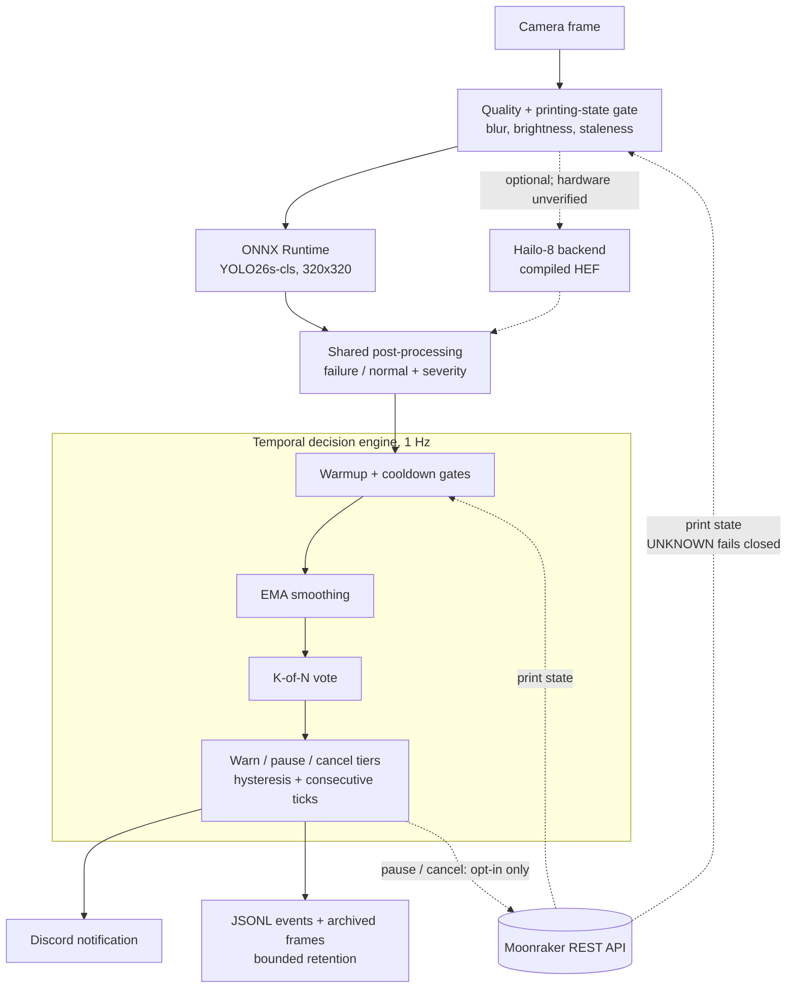

<!-- date: ongoing -->

# A.R.G.U.S.: 3D Print Failure Classifier

*Automated Recognition of Gone-wrong, Unrecoverable Spaghetti*

A binary print-failure classifier and monitoring service for Klipper/Moonraker printers,
targeting my Voron Trident on a Raspberry Pi 5. A YOLO26s-cls model, trained with Ultralytics
and fine-tuned directly through its ONNX graph in tinygrad, distinguishes `failure` from
`normal`. A temporal decision engine turns those predictions into notifications and,
when explicitly enabled, printer actions.

The current config is **notify-only**. The model has been evaluated on public-dataset
stills, not calibrated on recorded Trident prints. Good image classification results
do not establish that it is safe to interrupt a real print.

---

## Motivation

Spaghetti can keep growing for hours after a print has already failed. Catching it early
is useful, but a false stop on a healthy twelve-hour print is expensive too. The project
therefore has two separate problems: learning what a failed print looks like, and deciding
whether enough trustworthy evidence has accumulated to act.

The biggest improvement came from changing the data problem. The earlier multi-class
approach mixed normal images from one dataset with defect images from another, allowing
dataset origin to become a shortcut for the label. The current binary model uses one
source containing both labels, and splits by independent scene rather than individual frame.

## How It Works

One Python service, with no firmware or `printer.cfg` changes for the camera path:

The configured backend is ONNX Runtime on the CPU. The classifier's ONNX metadata records
the class order, `failure` then `normal`; a conflicting config fails at startup instead
of silently swapping the labels. A normal prediction emits no detection. Failure predictions
must clear their class threshold before contributing to the catastrophic failure score.

Runtime inference does not depend on Ultralytics or tinygrad. Those are training tools;
the service uses ONNX Runtime, OpenCV, NumPy, requests and YAML configuration.

## Fine-Tuning an Exported Model

The base YOLO26s-cls was trained with Ultralytics on an M3 Pro using MPS, then exported to
ONNX. tinygrad's `OnnxRunner` imports that graph as differentiable tensor operations, so
I could fine-tune the exported weights and write them back into a copy of the original graph.

That required handling the export's actual contract, not just loading a checkpoint:

- The input and attention-block reshapes assume batch size one. Training makes those
  dimensions dynamic on a temporary graph; the saved model keeps the original static contract.
- The graph ends in Softmax. The training loss reads the pre-Softmax logits, while inference
  recognizes probabilities so it never applies Softmax twice and flattens the confidences.
- The saved graph preserves the class-name metadata. The deployment export uses opset 11
  for the planned Hailo compilation path, with a `1x3x320x320` float32 input.

The selected model has approximately 5.4 million parameters. Checkpoint selection focused
on a usable confidence threshold, not simply the highest validation score: longer training
produced overconfident mistakes and worse operating points.

## Rebuilding the Dataset Boundary

The current builder pools all published splits of `Masamsa/3d-print-failure-detection`,
clusters near-duplicate frames using perceptual hashes, excludes mixed-label clusters,
and assigns each remaining scene to only one split. Training and runtime share the same
resize-and-center-crop geometry.

| Audit result | Count |
|---|---:|
| Images pooled from the published splits | 2,714 |
| Exact duplicates | 0 |
| Independent scene clusters | 1,220 |
| Clusters crossing the source's published train/test boundary | 147 |
| Mixed-label clusters excluded | 21, containing 505 images |
| Images retained in the scene-disjoint split | 2,209 |

The final split contains 1,547 training images, 331 validation images and 331 test images.
The test set has 95 failure images and 236 normal images. Counting independent scenes
alongside files makes the leakage visible instead of letting timelapse frames inflate
the apparent amount of evidence.

## Measured Results

The repository reports these results for the selected tinygrad-fine-tuned YOLO26s-cls
on the 331-image test split:

| Metric | Result |
|---|---:|
| Argmax top-1 accuracy | 98.49% |
| Failure precision at the default threshold | 0.979 |
| Failure recall at the default threshold | 0.968 |
| Failure images classified correctly | 92 / 95 |
| Normal images classified correctly | 234 / 236 |
| Per-frame false positives at the shipped 0.78 threshold | 0 / 236 normal images |
| Failure recall at the shipped 0.78 threshold | 0.968 |

The top-1 result and the thresholded operating point are different measurements. Raising
the failure threshold filters the two false-positive predictions while retaining the
reported recall on this split. The 0.78 threshold was selected from that test sweep;
the zero-false-positive result is therefore a measured point on an inspected dataset,
not an independent guarantee for a new camera or a hundred hours of printing.

YOLO26s has not yet been replayed through the decision engine for end-to-end calibration.
Failure-onset latency and false positives per print-hour remain unmeasured on real footage.

## The Safety Layer

The decision engine combines a warmup window, EMA smoothing, K-of-N voting, separate
warning/pause/cancel tiers, consecutive-tick requirements, hysteresis and cooldown.
Printer-state failures resolve to `UNKNOWN` and gate off action. Cosmetic classes cannot
drive a stop, and cancellation is disabled in the shipped config.

The service archives frames and JSONL event records with bounded retention, sends Discord
notifications, and supports an operator-defined pause macro. Offline pytest coverage
checks the decision logic, camera and quality gates, classifier metadata and preprocessing,
Hailo helper contracts, integration behavior, notifications and storage.

Temporal filtering is not a substitute for better data. A healthy support tower that is
misread in every frame can pass a voting window just as easily as a real failure. That is
why notify-only remains the default until the complete pipeline is calibrated on real prints.

## Built vs. Still to Validate

| Component | Current status |
|---|---|
| Binary classifier, ONNX runtime, decision engine and Moonraker integration | Implemented |
| Discord notifications, event storage, recording and replay tools | Implemented |
| Hailo-8 AI HAT+ backend and calibration-set builder | Implemented; not verified on hardware |
| Real Trident footage and end-to-end calibration for YOLO26s | Pending |
| ADXL345 vibration model and vision/vibration fusion | Planned; not implemented |

The Hailo backend shares classifier post-processing with ONNX Runtime, but its compiled
HEF and INT8 confidence threshold still need on-device validation. The goal is to free
the Pi's CPU for printer workloads; inference latency has not yet been benchmarked on the Pi.

Next steps are hardware validation, recording and replaying real Trident prints, measuring
detection latency, and eventually adding accelerometer fusion and a broader defect taxonomy
without reintroducing the dataset-origin shortcut.

## Stack

Python 3.10+ · YOLO26s-cls / Ultralytics (training) · tinygrad (fine-tuning) · ONNX Runtime ·
OpenCV · NumPy · Moonraker REST API · Discord webhooks · pytest · Hailo-8 (hardware validation pending)
