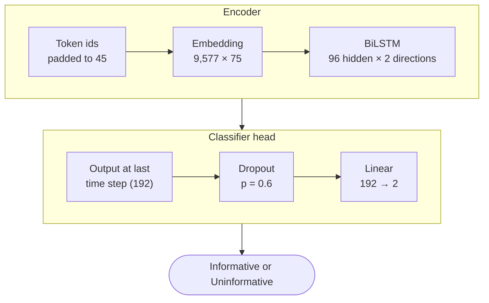

<!-- date: May 2025 -->

# BiLSTM COVID-19 Tweet Classifier

A small bidirectional LSTM that decides whether a COVID-19 tweet is **informative** (it reports
confirmed, suspected, recovered, or fatal cases, or where and how people travelled) or
**uninformative**. Built with Sahil Jain as the final project for ECE 364 (Programming Methods
for Machine Learning) at UIUC, on the [WNUT-2020 Task 2](https://github.com/VinAIResearch/COVID19Tweet)
shared-task dataset.

---

## The task and data

WNUT-2020 Task 2 is binary classification over English tweets from early 2020. The labels are
close to balanced, so plain accuracy is a fair headline metric:

| Split | Tweets | Informative | Uninformative |
|-------|--------|-------------|---------------|
| Train | 7,000 | 3,303 | 3,697 |
| Validation | 1,000 | 472 | 528 |
| Test | 2,000 | 944 | 1,056 |

Only the training split was used to fit the model. Validation loss was used to pick
hyperparameters, and the final numbers below are on the held-out test split.

## Pipeline

Everything upstream of the model is written by hand rather than pulled from a tokenizer library:

1. **Tokenize**: lowercase, then keep word characters only (`re.findall(r'\w+', text.lower())`).
   The dataset already masks users and links as `@USER` and `HTTPURL`.
2. **Vocabulary**: built from the training tweets with a minimum frequency of 2, giving 9,577
   tokens including `<pad>` and `<unk>`.
3. **Encode and pad**: map tokens to ids (unknown words to `<unk>`), then pad or truncate every
   tweet to 45 tokens.
4. **Dataset**: a custom PyTorch `Dataset` wraps the DataFrames and returns tensors, batched 32
   at a time.

## Model



```python
class Binary_Classifier(nn.Module):
    def __init__(self, vocab_size, embed_dim, hidden_dim, num_classes=2):
        super().__init__()
        self.embedding = nn.Embedding(vocab_size, embed_dim)
        self.lstm = nn.LSTM(embed_dim, hidden_dim, batch_first=True, bidirectional=True)
        self.fc = nn.Linear(hidden_dim * 2, num_classes)
        self.dropout = nn.Dropout(p=0.6)

    def forward(self, x):
        x, _ = self.lstm(self.embedding(x))
        return self.fc(self.dropout(x[:, -1, :]))
```

**851,525 parameters** in total, and about 718k of those are the embedding table. The heavy
dropout was deliberate: with only 7,000 training tweets, the model starts memorising quickly.

## Training

| Setting | Value |
|---------|-------|
| Optimizer | Adam, lr = 1e-3, weight decay = 1e-4 |
| Loss | Cross-entropy |
| Batch size | 32 |
| Epochs | 10 |
| Training time | About 8-9 minutes (Google Colab) |

Validation loss bottomed out at **0.447 at epoch 8** and ended at 0.487 after epoch 10, while
training loss kept falling to 0.238. That gap is the overfitting the dropout and weight decay
were there to slow down.

## Results

**76.8% test accuracy** (1,536 of 2,000 tweets correct).

| Class | Precision | Recall | F1 |
|-------|-----------|--------|----|
| Informative | 0.80 | 0.68 | 0.73 |
| Uninformative | 0.75 | 0.85 | 0.79 |
| **Macro average** | | | **0.76** |

The model is conservative about calling a tweet informative: of its 464 mistakes, 303 were
informative tweets labelled uninformative.

## What we tried

- **Hyperparameter sweeps** over embedding size, hidden size, epochs, learning rate, and weight
  decay. Poor settings showed the same signature every time: validation loss hits an early low,
  then climbs fast.
- **Swapping the LSTM for a GRU**, plus pooling layers. Convergence was a little faster, but the
  loss did not improve and the same overfitting pattern remained.
- **A small pretrained model** (`prajjwal1/bert-tiny` from Hugging Face). Pretraining helps a
  lot on a dataset this small, but integrating its vocabulary pushed training time well past
  our budget.

## What I'd do differently

- **Use the real final state, not the last padded step.** `x[:, -1, :]` reads the output at
  position 45, which for most tweets is padding. The backward direction is fine there, but the
  forward direction has spent the end of the sequence reading `<pad>`. Packing the sequences
  (`pack_padded_sequence`) or concatenating the two final hidden states would give the
  classifier a cleaner signal at no extra cost.
- **Early stopping on validation loss**, keeping the epoch-8 checkpoint instead of epoch 10.
- **Fine-tune a tweet-specific transformer** such as BERTweet, now that the baseline is
  established. The strongest shared-task systems were fine-tuned transformers.

## Stack

Python - PyTorch - pandas - NumPy - Matplotlib - Google Colab
