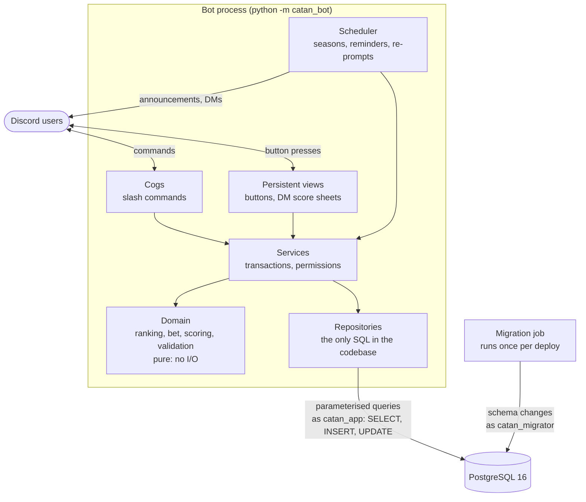

<!-- date: 09-20-2026 -->

# Catan Tracker

A Discord bot that runs a Catan league for a friend group. Players report games, everyone
confirms the result, and the bot keeps seasonal win-rate standings. When a season ends, the
lowest-ranked eligible player buys food for the top-ranked one. It also schedules game nights
with RSVPs and reminders.

It started as a scoreboard and turned into a small production service: async Python on
PostgreSQL, deployed with Docker Compose on an always-on Oracle Cloud ARM VM, with a security
model I'd be comfortable defending.

---

## What it does

- **Confirmed game reports.** `/game report` records the winner, losers, ruleset (base game,
  Seafarers, Cities & Knights, or both, with the 5-6 player extension), scenario, target score,
  and local play time. The game exists immediately, but it only counts once another
  participant presses **Confirm** on the public message. The reporter can't confirm their own
  game.
- **Per-player score sheets over DM.** Each participant gets a private one-page sheet for their
  own row only: settlements, cities, Longest Road or Longest Trade Route, Largest Army,
  victory-point cards, plus Cities & Knights and scenario points when the ruleset has them. The
  public message doubles as a live scoreboard, filling in a check mark as each row arrives.
- **Chasing missing scores.** Anyone who hasn't submitted is re-prompted about once a day, up to
  three times, with a channel notice naming who's still missing. A player with DMs closed is
  marked as such and can use `/game scores` instead, and the chase stops after three rounds.
- **Seasons and the bet.** Standings rank eligible players (a minimum-games threshold, default
  2) by win rate, then wins, then games. The scheduler resolves a season when it ends and posts
  a frozen result.
- **Game nights.** `/event create` posts an event with Going / Maybe / Not going buttons,
  optional role pings, and targeted reminders.
- **Admin corrections.** `/game update` edits a confirmed game in place. Every edit increments
  an audit revision and records who made it and why.

## Design



The layers are enforced, not just suggested. **Domain** code (ranking, bet resolution,
validation, scoring rules, reminder timing) is pure: no I/O, no Discord, no database, so it is
tested directly. **Services** own transactions and permission checks on the server side.
**Repositories** are the only place SQL is allowed to exist. Static tests fail the build if a
cog reaches past the service layer or domain code imports anything impure.

Buttons are **persistent views**: their custom IDs encode the game or event, so a Confirm button
on a week-old message still works after the bot restarts.

### Exact ties

A tie at the top of the standings decides who gets fed, so win rates are compared exactly.
Ranking uses `fractions.Fraction`, so 1/3 and 2/6 are equal rather than "equal after rounding":

```python
def _sort_key(stats, *, min_games):
    eligible = stats.games >= min_games
    return (not eligible, -stats.win_rate, -stats.wins, -stats.games, stats.user_id)
```

Ties share a rank (standard competition ranking: 1, 1, 3). Everyone tied at the top gets fed,
everyone tied at the bottom splits the bill, and if every eligible player is tied, there's no
bet at all.

## Security

The bot takes free-text input from anyone in a server, so SQL injection was treated as a
design constraint from the first commit rather than a review item:

- **Parameterised queries only.** Every query is a module-level string constant with `$1, $2`
  placeholders. Nothing is ever built from input.
- **An AST guard that fails closed.** A static test parses every module in `src/` and rejects
  any database call outside the repository layer, any query argument that isn't a sound string
  constant, stacked statements, and every indirect route to a database call
  (aliases, `getattr`, `operator.methodcaller`, `__import__`, `sys.modules` tricks, and more).
- **Least-privilege roles.** The runtime role can only `SELECT`, `INSERT`, and `UPDATE`. It
  cannot `DELETE`, `DROP`, `TRUNCATE`, or `ALTER`. Schema changes run under a separate migrator
  role in a one-shot container.
- **Bounded everything.** A server-side `statement_timeout` on every pooled connection, a
  client-side command timeout, the database port bound to localhost, and Discord mentions
  disabled by default so a crafted name can't ping a whole server.
- **Guild isolation.** Every table is scoped by server, with integration tests proving one
  server can never read or modify another's data.

## Testing and CI

About 1,200 test functions across three suites:

- **Unit**: domain logic, formatting, buttons, and services against fakes, with Hypothesis
  property tests on ranking and bet resolution.
- **Integration**: repositories, services, the scheduler, migrations, privilege boundaries, and
  concurrent-confirmation races against a real PostgreSQL 16 instance.
- **Static**: the SQL guard, layer boundaries, domain purity, and migration hygiene.

GitHub Actions runs `pip-audit`, `ruff`, `bandit`, and the full suite against a Postgres service
container on every push, with third-party actions pinned to commit SHAs.

## Stack

Python 3.12 - discord.py - asyncpg - PostgreSQL 16 - pydantic-settings - Docker Compose -
pytest - Hypothesis - ruff - bandit - GitHub Actions - Oracle Cloud (OCI)
