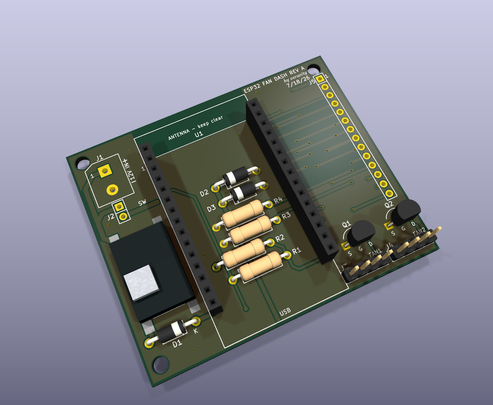
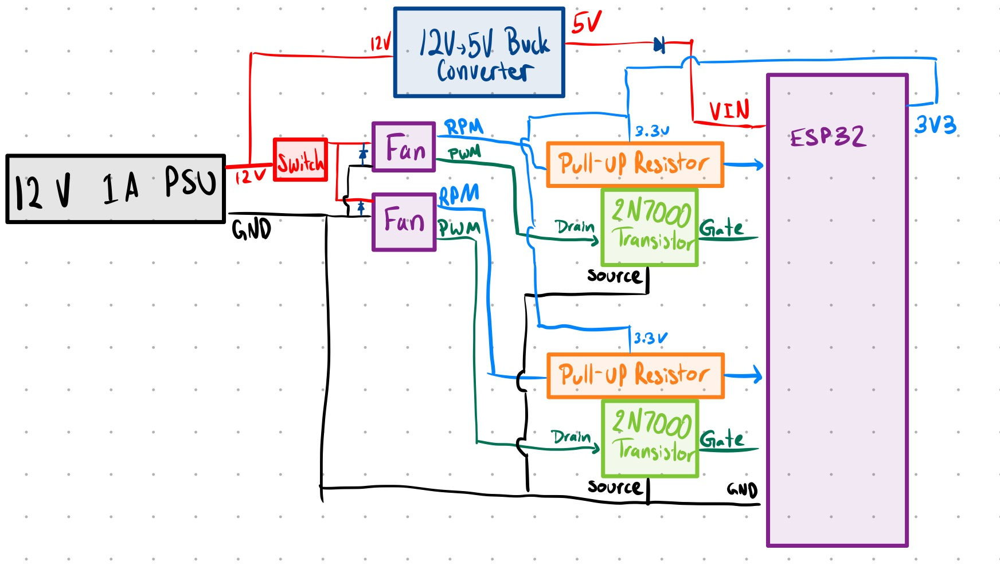
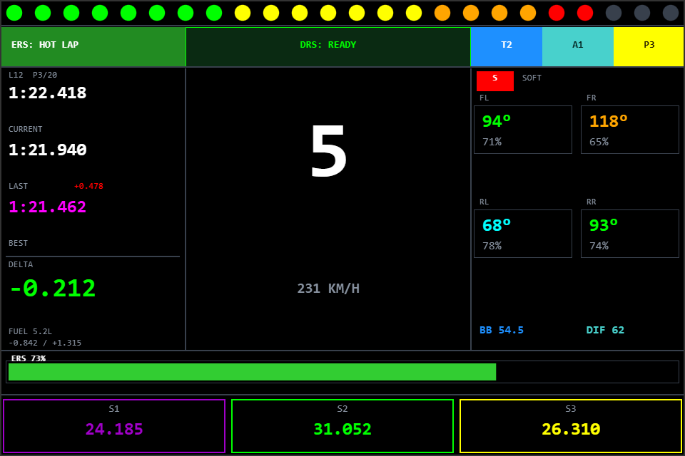
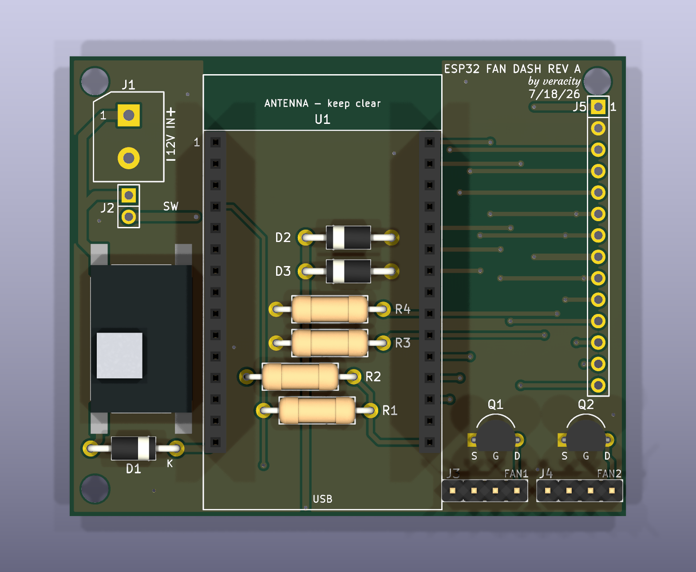
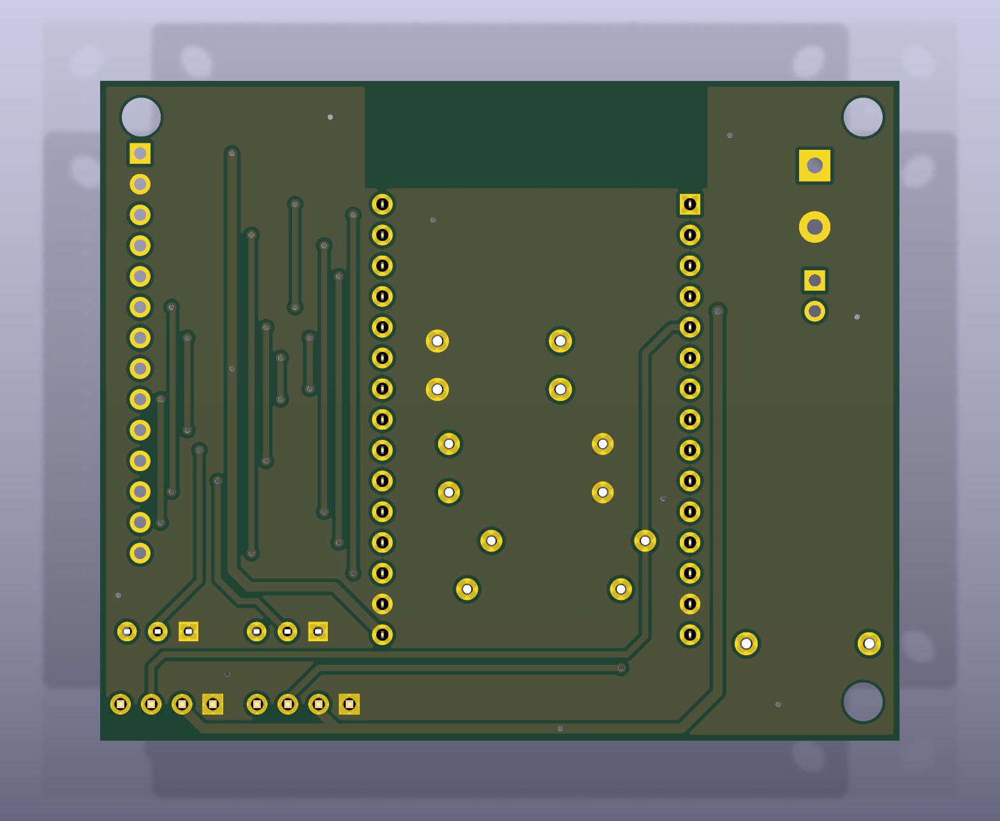
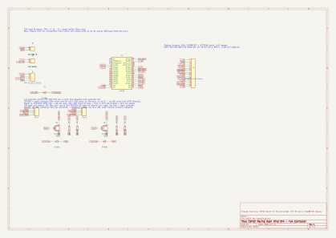

<!-- date: ongoing -->

# ESP32 Racing Dashboard

An F1-style sim racing dashboard built around an ESP32 and an ILI9488 display. It reads live
telemetry from SimHub and draws gear, lap times, tyres, sector splits and race flags in real
time. What started as a simple display project has turned into a full custom PCB with wind
simulation fans, and it's still growing.



*The board as designed in KiCad, 66.1 x 54.5 mm, 2-layer, fully through-hole. The DevKit's
USB end sits flush with the bottom edge so the cable is never blocked, and the fan headers
(J3/J4, bottom right) exit right next to it.*

---

## Background

This project didn't start as ambitious as it looks now. The first version was just a proof
of concept, which was an ESP32 on a breadboard, reading a CSV string over serial and drawing a basic
dashboard on an ILI9488 panel. No PCB, no case, just wires and a display propped up next to
my steering wheel.

Once the dashboard itself worked, the obvious next step was making it feel more like an
actual sim rig accessory instead of a dev board taped to a shelf. That meant a real board.
I designed a through-hole PCB around a socketed ESP32 DevKit V1, broke out the full SPI and
touch header for the display, and along the way decided the thing needed more than numbers
on a screen. Two PWM-driven fans got added for a wind-simulation effect that speeds up
and slows down with the car, so accelerating and braking feels immersive.

At the same time, I ported the firmware into [ESP-SimHub](https://github.com/v3rac1ty/ESP-SimHub),
an open source SimHub firmware framework for ESP32 and ESP8266, instead of keeping it as a standalone sketch. That
meant giving up my own hand-rolled serial protocol and rebuilding the telemetry parsing on
top of SimHub's real transport layer, which was more work up front but means the dashboard
now benefits from the same infrastructure as every other gauge and motor driver in that
project.

The current focus is cutting the USB cable entirely. ESP-SimHub already has WiFi and
ESP-NOW connection modes built in for other devices, so the plan is to get this dashboard
running wireless too rather than tethered to a PC over serial. That work is still in
progress, along with actually wiring the fans up to real telemetry (right now they spin,
but nothing in software maps car speed to fan duty yet).

---

## From napkin sketch to schematic

Before any of this touched KiCad, I sketched the power and fan side of the board by hand to
make sure the logic actually made sense.



*The original sketch. Almost every part of this made it into the real schematic unchanged.*

Working through it roughly in the order I drew it:

**Start with the power source.** A 12V 1A PSU feeds everything. I put a switch right after
it so the fans can be killed independently without powering down the ESP32 or display,
useful for a quiet lap around the paddock without wind blowing in your face.

**The fans need more than just 12V.** Each fan has its own RPM (tach) and PWM line. I drew a
small diode next to each fan's power connection early on, because a fan motor can kick back
voltage when it spins down, and I wanted a defined path for that rather than hoping the fan's
own internals handled it. Those diodes made it straight into the real board as D2 and D3.

**Driving the PWM line took a bit more thought.** You can't just wire a GPIO straight to a
fan's PWM input. These fans pull that line up internally toward 5V, and ESP32 pins aren't 5V
tolerant, so driving it directly risks damaging the chip. The fix was a 2N7000 per fan,
wired so the ESP32 only ever pulls the line low (gate from the ESP32, drain to the fan's PWM
pin, source to ground). The transistor never drives voltage onto that line, it only sinks it,
so the ESP32 side never sees anything above 3.3V.

**Reading fan speed back has the same problem in reverse.** The tach output is open-collector
too, so it needs a pull-up to actually read as a clean high/low signal. I pulled it up to
3.3V instead of 5V, sourced straight from the ESP32's own onboard regulator (the loop back to
the ESP32's 3V3 pin in the sketch), since that pull-up feeds directly into a GPIO.

**Powering the ESP32 itself** meant a 12V to 5V buck converter into VIN. I added a diode
right after the buck (the small triangle and bar in the sketch) so power can't flow backward
into the buck if the board is ever connected over USB at the same time. That diode became D1
on the final board, and it's the one part with some flexibility. If your DevKit already has
its own back-feed protection built in, you can wire a plain link there instead.

Everything grounds out at the bottom of the sketch, transistor sources included. Once this
made sense on paper, translating it into an actual KiCad schematic and then a PCB layout was
mostly mechanical. The circuit didn't change. What changed was pin numbers, footprints, and
fitting all of it onto a board small enough to actually build.

---

## Display Layout



The screen is split into three rows. Top is an RPM strip. Below that, an info bar for ERS
mode, DRS status, TC/ABS levels, and race position. The main body has three columns: lap
times and fuel on the left, gear front and center, tyres and setup readouts on the right.
The bottom bar holds the ERS gauge and the three sector times.

Each widget only redraws when its value actually changes, instead of clearing and repainting
the whole screen every frame, so there's no flicker.

Sector boxes turn purple for a session best, green for a personal best, yellow otherwise.
Tyres shade from blue through cyan, green, orange, and red as they heat up, and each corner
shows a one-letter compound badge colored to match. RPM dots run green to yellow to orange
to red toward redline.

The center panel also acts as a popup surface when something important happens on track. Red
flag beats safety car beats virtual safety car beats pit limiter beats yellow or blue flags
beats a quick "all clear" green flash beats a brake bias/differential readout when you adjust
either from the wheel. Only the highest priority one shows at any time.

---

## Hardware

The board is fully through-hole, hand-solderable, no SMD parts anywhere.



| Ref | Part | Detail |
|-----|------|--------|
| U1 | ESP32 DevKit V1, 30-pin | Socketed on female headers, not soldered down so USB stays accessible. Board uses 25.4mm (1.0") row spacing |
| - | ILI9488 3.5" SPI, 480x320, 18-bit color | Plus XPT2046 resistive touch on the same 1x14 header |
| Q1, Q2 | 2N7000 N-MOSFET, TO-92 | Open-drain PWM drivers into each Arctic P12 fan's PWM line |
| J3, J4 | Arctic P12 PWM PST CO, 4-pin | GND, +12V continuous, tach, PWM. True PWM fans, not switched power |
| D1 | 1N4001 or wire link | Blocks USB back-feed into the buck's 5V rail toward VIN |
| D2, D3 | 1N4001, DO-41 | 12V rail clamp at each fan connector, extra margin for fans with weaker internal transient protection than the Arctic P12 |
| R1, R2 | 10k ohm, 12.7mm pitch | Tach pull-ups to 3.3V (GPIO34/35 are input only, no internal pull-up) |
| R3, R4 | 10k ohm, 12.7mm pitch | Gate pull-downs, hold both FETs off at boot so an uninitialized board defaults to full-speed fans |
| - | Mini 5V buck module, 17.5x12mm | 12V to 5V for the ESP32, mounted with foam tape inside a matching silk outline, wired to J6 by hand |

Board size: 66.1 x 54.5 mm. Every trace corner is 45 degrees or straight, no 90 degree bends
anywhere on either copper layer.

### Design iteration and verification

The board went through several real revisions, not one clean pass. It started around
100x70mm, shrank twice as parts got placed more efficiently, grew back a bit to fit a pair
of 12V rail clamp diodes (D2/D3) that weren't part of the original plan, then shrank again to
the current 66.1x54.5mm by tucking R1 through R4 and D2/D3 underneath the socketed DevKit
module. They lay flat between the header rows, using the roughly 8.5mm of clearance a
socketed (rather than soldered down) DevKit leaves underneath it.

- A custom verification pass reloads the finished `.kicad_pcb` and checks a few things a
  normal DRC run doesn't catch: footprint bounding box overlaps, any trace corner bending
  more than 46 degrees, and the full pad-to-net map against what was actually intended. Not
  just "does it route," but "does it route to the right pin."
- Standard ERC and DRC are held to zero errors and zero warnings, not just the error tier.
  That includes silkscreen-over-copper and silkscreen-overlap warnings, which are easy to
  leave sitting there since they don't block fabrication.
- Both layers have a ground pour tied together with stitching vias, and the antenna end of
  the DevKit module has a keep-out area so no copper sits underneath it.

The display header (J5) mounts the ILI9488 module to the back of the board. Since that flips
the header vertically, J5's pad order is deliberately the reverse of the display's own pin
order, display pin 1 lands on J5's last pad and vice versa, so the wiring lines up correctly
once the module is on the back face.



*Back side copper: the display's SPI/touch corridor (the parallel diagonal traces on the
right) and the routing that runs under the socketed DevKit to reach R1 through R4 and D2/D3.*

### Display and touch wiring

```
ILI9488 + XPT2046  ->  ESP32 DevKit
------------------------------------
VCC        ->  3.3V
GND        ->  GND
CS         ->  GPIO 15
DC/RS      ->  GPIO 2
RESET      ->  GPIO 4
SDI(MOSI)  ->  GPIO 23
SCK        ->  GPIO 18
SDO(MISO)  ->  GPIO 19
LED        ->  3.3V
T_CS       ->  GPIO 21
T_IRQ      ->  GPIO 22
T_CLK, T_DIN and T_DO share the SCK/MOSI/MISO lines above (one SPI bus, separate CS)
```

Touch is wired to the header and accounted for in the pin plan, but the current
`ENABLED_SIMHUBDASH` renderer doesn't read it yet, there's no touch-driven UI in this version.
The fans are in a similar spot. The 2N7000s are wired up and working as open-drain drivers,
tach lines are pulled up correctly, but ESP-SimHub doesn't map any telemetry field to their
PWM duty yet. That's next, either through ESP-SimHub's existing `SHShakeitPWMFans`
motor-output feature or a small speed-to-duty mapping built into the dashboard code itself.

### Schematic



---

## Software Architecture

### Riding ESP-SimHub's transport instead of a homemade one

The old standalone version hunted for a `"SH;"` sync header in a raw serial stream by hand.
That's gone now. The dashboard runs entirely inside ESP-SimHub's existing transport stack:

- SimHub's ARQ (Automatic Repeat Request) layer frames every packet with a sequence ID and
  CRC-8, retransmitting on a mismatch. It's the same transport every other ESP-SimHub
  feature, gauges, RGB, motors, already relies on.
- The dashboard rides SimHub's real Custom Serial Protocol (the `'P'` command) instead of a
  homemade framing scheme. ESP-SimHub's command layer already delineates exactly one payload
  per call, so the old `SH;` sync literal isn't needed anymore. There's nothing left to
  resynchronize against.
- The payload runs well over 200 bytes, past the ARQ layer's 32-byte-per-packet limit.
  `ArqSerial::read()` handles that transparently, decoding and acknowledging as many
  sequential packets as it takes before handing the full payload back.

### `SHDashData.h`, the telemetry snapshot

```cpp
struct SimHubDashData {
    String gear;         int speed;        int rpmPct, rpmRedline;
    String curLap, lastLap, bestLap, delta;
    int    lap, position, numCars;         float fuel;    bool lapInvalid;
    int    tcLevel;      bool tcActive;    int absLevel;  bool absActive;
    float  brakeBias;    int diffOnThrottle;
    float  tyreTFL, tyreTFR, tyreTRL, tyreTRR;
    String s1Time, s2Time, s3Time;         int s1Flag, s2Flag, s3Flag;  // purple/green/yellow
    bool   drsAvailable, drsEnabled;
    float  gapFront, gapBehind;
    int    ersPct, ersMode;                String lastLapDelta;
    String tyreCompound;                   int tyreWearFL, tyreWearFR, tyreWearRL, tyreWearRR;
    int    flagStatus;                     String safetyCarDelta;  int safetyCarStatus;
    bool   pitLimiterOn;
};
```

This grew from about 18 fields in the original version to 43. Sector color flags, DRS state,
live gaps to the cars ahead and behind, ERS mode and percentage, tyre compound and wear per
corner, and the race flag states all got added later, alongside the popup system mentioned
above.

One thing worth flagging: `SHDashProtocol::read()` reads the `'P'` payload as a fixed,
ordered sequence with no per-field framing to resynchronize against. The field order in
`SHCustomProtocol.RacingDashboard.txt` has to match `SHDashProtocol.h`'s read sequence
exactly, or the ARQ stream desyncs from that point on with no way to recover gracefully.
Editing one file without the other is the easiest way to break this whole feature.

### Debugging a freeze in SimHub's formula engine

Building the 43-field formula surfaced two real bugs, both in the formula itself rather than
the firmware. Both caused the exact same symptom, the display freezing about a minute into a
session, for two completely different reasons.

The first was the last-lap-delta calculation subtracting two SimHub `TimeSpan` values
directly with a minus sign. NCalc turns each side into a string like `"0:01:18.740"` first,
then tries to parse that string as a number, which throws once both times are non-null. The
fix was converting both sides with `timespantoseconds()` before subtracting.

The second bug is the one that kept the freeze happening even after fixing the first. The lap
time display fields were calling `left([CurrentLapTime], 3, 8)`. Turns out `left()` isn't
actually a real NCalc function. NCalc only has `format(timespan, formatstring)` and
`timespantoseconds()`/`secondstotimespan()` for TimeSpan values. Calling a function that
doesn't exist throws on every single evaluation, which lines up with a permanent freeze much
better than the first bug's once-per-lap trigger.

I confirmed both by replaying a captured SimHub session log line by line against the actual
exception text before writing a fix, not by guessing. The corrected formula formats lap times
directly with .NET's custom TimeSpan tokens (`format([CurrentLapTime],'m\\:ss\\.fff')`), and
every other numeric field picked up an `isnull()` guard it had been missing.

---

## Build & Flash

```bash
pio run -e esp32            # compile
pio run -e esp32 -t upload  # flash
```

Hold BOOT during upload if the board doesn't auto-reset.

---

## SimHub Setup

1. Set `ENABLED_SIMHUBDASH` to `1` in `src/main.cpp` (SimHub's config generator can do this
   for you, or just edit the `#define` directly).
2. Serial Devices, Add, Custom Serial Devices, then select the ESP32's COM port.
3. Open Edit custom protocol and paste the formula from
   [`SHCustomProtocol.RacingDashboard.txt`](https://github.com/v3rac1ty/ESP-SimHub/blob/main/SHCustomProtocol.RacingDashboard.txt)
   into "Update messages."
4. Enable "Send update messages." Start conservative, around a 50 to 100ms interval, since
   the ARQ multi-packet round trip adds latency compared to a raw high-baud link. Tune it
   down once frame delivery keeps up.
5. Start a session. The dashboard comes alive within a few seconds.

---

## Stack

C++, PlatformIO, TFT_eSPI, a custom ILI9488 driver, ESP-SimHub's ARQ transport and Custom
Serial Protocol, SimHub NCalc formulas, KiCad for the 2-layer through-hole PCB, ESP32 DevKit V1.
