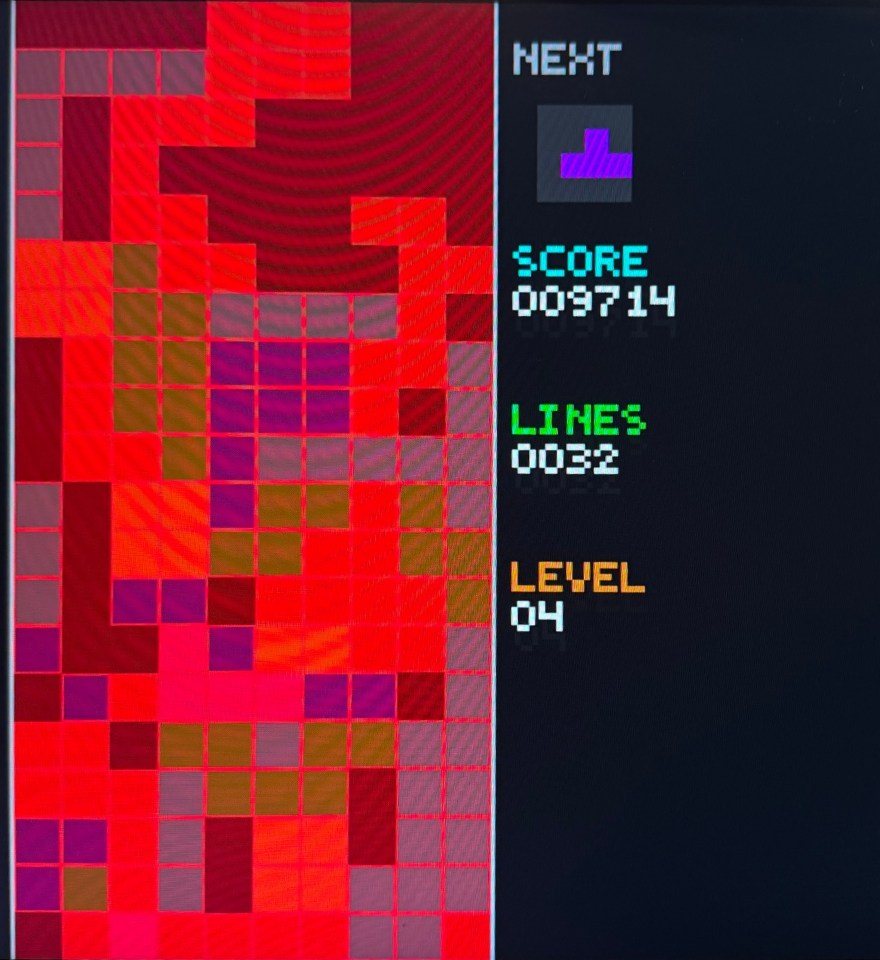
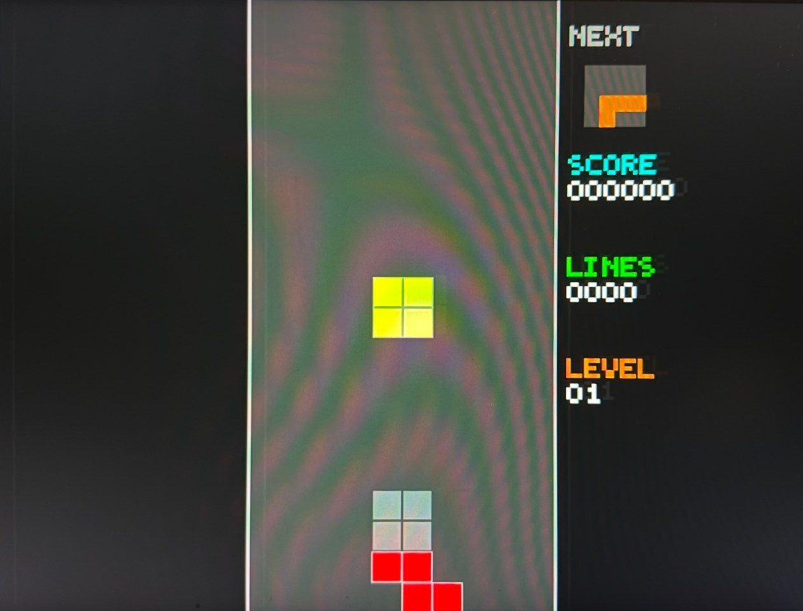
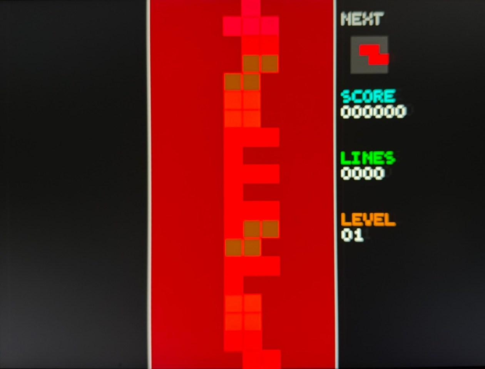

<!-- date: May 2026 -->

# Tetris on an FPGA

A complete Tetris game implemented in SystemVerilog on the Urbana board for UIUC's ECE 385
(Digital Systems Laboratory). Nothing about the game itself runs in software: movement,
rotation, collision, line clears, scoring, and the whole 640x480 HDMI frame are hardware.
The only software in the design is a MicroBlaze soft core running the USB keyboard driver.

*Level 4, 9,714 points, 32 lines. The red tint means the stack has just topped out; the
game-over overlay is applied per-pixel in the renderer rather than drawn as a separate
screen.*

---

## The Platform

The Urbana board is an FPGA-based educational platform designed to host a wide range of
digital systems and microprocessor IP/core designs. It's built around AMD's Spartan-7 FPGA
and includes 128 MB of DDR3, an SD card interface, a Bluetooth radio, a USB2 host, and a
set of other peripherals. AMD's free Vivado/Vitis tools cover design entry, simulation,
synthesis, and programming, and a single USB connection supplies power, a UART/COM port,
and the programming port.

This project used the USB host (a MAX3421E controller over SPI) for keyboard input, the
HDMI output for video, and the on-board seven-segment displays as a debug readout.

## Architecture

The design is split into three pieces, joined in `mb_usb_hdmi_top.sv`:

- **MicroBlaze block design.** A MicroBlaze soft processor with AXI Quad SPI, GPIO,
  UART, a timer, and an interrupt controller. It runs a small C program that enumerates
  the USB keyboard through the MAX3421E, polls HID reports, and writes the current
  keycodes out over AXI GPIO. That's all it does.
- **`tetris.sv`, the game engine.** A pure-hardware state machine clocked by VSYNC, so
  it advances exactly once per frame (~60 Hz). It takes the raw 8-bit keycode and owns
  every piece of game state.
- **`color_mapper.sv`, the renderer.** Combinational logic that takes the current
  `(DrawX, DrawY)` from the VGA timing controller and decides that pixel's color by
  reading game state. It feeds an HDMI transmitter IP running off a 25 MHz pixel clock
  and a 125 MHz serializer clock.

Because the game state only changes on the frame clock and the renderer reads it
continuously, every frame is drawn from a consistent snapshot without needing a
framebuffer at all.

## Game Engine

### Board and pieces

The playfield is a `[0:19][0:9]` array of 3-bit registers: 0 for empty, 1-7 for the
tetromino that locked there, so the board remembers each cell's color. Each piece is stored
as four 16-bit bitmasks (one per rotation) over a 4x4 grid, where bit `ly*4 + lx` marks an
occupied cell. The engine and the renderer each carry an identical copy of this table as a
small combinational ROM.

### Game states

The FSM moves through `RESET → SPAWN → PLAY → LOCK → CLEAR → SPAWN …`, dropping into
`OVER` if a freshly spawned piece collides with the stack. Each piece gets a per-shape spawn
offset (I, J, and L spawn two rows above the board, and the others one row above) so its
topmost cells land exactly on row 0.

### Parallel collision checks

Collision detection doesn't happen when a key is pressed. There is one `always_comb` block
per possible move (left, right, down, rotate in place, and four rotate-with-kick offsets:
+1, -1, +2, -2) and a spawn check. Every one of them evaluates against the current board
every cycle, so when an input arrives the FSM just reads a flag. Rotation tries the in-place
result first and falls back through the kick offsets in order, which makes rotating against
a wall or the stack behave the way players expect.

Each checker also uses a per-column "topmost occupied row" table to reject board reads for
cells that are above the stack in that column.

### Ghost piece and hard drop

The ghost piece (the preview of where the current piece will land) is one more
combinational block. It slides the current shape down row by row until it hits something
and outputs the drop distance. Hard drop (Space) reuses the same value: it moves the piece
by the ghost distance and locks it in the same frame, awarding one point per row dropped.

*The grey 2x2 above the red Z is the ghost of the falling yellow O: the renderer draws the
active shape a second time at `ghost_py`, and cells covered by both get the active piece's
color.*

### Line clears in a single cycle

Clearing lines doesn't need a multi-frame animation loop. A combinational block walks the
board from the bottom up with a write pointer, copying every non-full row down and leaving
zeros at the top. In the `CLEAR` state the FSM checks whether any rows were full and, if so,
latches the entire compacted board in one clock edge.

### Scoring, levels, and randomness

- Line clears score 100 / 300 / 500 / 800 for 1-4 lines, multiplied by the current level.
  Soft drop scores 1 per row, and hard drop scores 1 per row fallen.
- The level goes up every 10 lines (capped at 15). Gravity starts at a 48-frame fall
  interval and speeds up by 5 frames per level, down to one row per frame by level 9.
- The next piece comes from a 15-bit LFSR that steps every frame, so the sequence depends on
  exactly when each piece spawns.
- Inputs are edge-detected against the previous frame's keycode, so holding a key moves
  the piece once instead of sending it straight into the wall. Controls: WASD or arrow
  keys, Space for hard drop, P to pause, R to restart.

*Game over. When `game_over` is set, the renderer forces the red channel up and shifts
green and blue down inside the playfield. Pause uses the same trick, halving all three
channels to dim the board.*

## Renderer

There is no sprite memory or framebuffer. For every pixel, `color_mapper` works out whether
it falls in the board border, a board cell, or the side panel:

- **Board cells** are 24x24 pixels. The renderer computes the cell index and the pixel's
  offset inside that cell, draws a one-pixel grid line on the cell edges, and then picks a
  color: active piece first (with a lighter 3-pixel bevel on the top and left), then ghost,
  then locked cell, then empty.
- **Text** uses a 21-glyph 4x5 bitmap font (the digits plus the letters needed for NEXT,
  SCORE, LINES, and LEVEL), scaled 3x. Score, lines, and level are converted to decimal
  digits with divide/modulo in hardware.
- **Next-piece preview** samples the shape bitmask at 12-pixel resolution in a small box.

The BCD divide chains are deep enough to cause timing problems at 25 MHz, so the top level
registers score, lines, and level into the pixel-clock domain first. That keeps the dividers
out of the critical path between the frame-clocked game state and the pixel output.

The seven-segment displays show score and lines/level in hex as well, which was useful for
debugging scoring before the on-screen text worked.

## Notes on the photos

The monitor was mounted in portrait, so the original photos were sideways. They've been
rotated and perspective-corrected to show just the 640x480 output. The rippling pattern on
the board is moiré between the camera sensor and the one-pixel grid lines; it isn't on the
actual display.

---

## Stack

SystemVerilog, AMD Vivado & Vitis, Spartan-7 (Urbana board), MicroBlaze, AXI GPIO / SPI,
MAX3421E USB host, HDMI (TMDS), C.
