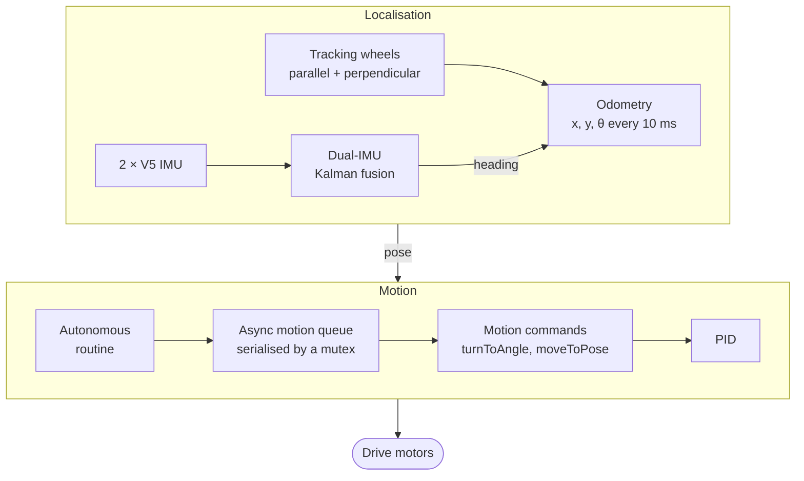

<!-- date: 2026 -->

# VEX Autonomous Navigation Stack

The autonomous navigation code behind Illini VEX Robotics, UIUC's VEX U team, from 2023 to 2026 across three
seasons: **Over Under** (2023-24), **High Stakes** (2024-25), and **Push Back** (2025-26). It is
written in C++ on [PROS](https://pros.cs.purdue.edu/), the open-source RTOS for the VEX V5 brain,
and runs two robots per season (a 15-inch and a 24-inch) from one shared codebase. The team
qualified for the VEX U World Championship in 2024, 2025, and 2026.

This is a team codebase. I led the software as Programming Lead, owning its direction and
the shared `common/` layer, and now advise the team as Programming Advisor. The sections
below say which parts I wrote myself.

---

## Context

A VEX U match opens with an autonomous period with no driver input, and the Skills challenge
adds a full minute of autonomy. Everything in those windows depends on the robot knowing where
it is on a 12 ft field and getting where it needs to go, repeatably, on carpet that lets the
wheels slip. The stack is layered so each season can swap mechanisms without touching
navigation:



## 1 - Pure Pursuit path following (Over Under)

Our 2023-24 robots followed pre-planned paths with Pure Pursuit, written mainly by teammate
Reid Faistl. Each control cycle the robot:

1. Intersects a look-ahead circle around itself with the path segments ahead (a quadratic in
   the segment parameter, where the discriminant gives the number of intersections).
2. Rejects solutions outside the current segment or behind the robot, keeping the one that
   makes the most forward progress.
3. Steers toward that look-ahead point with a differential-drive speed split.

The interesting part is the **ending**. Plain Pure Pursuit stops wherever the path stops, facing
whichever way it happened to arrive. To finish at a specific heading, the follower inserts an
extra waypoint behind the final point, along the desired final angle, so the robot is already
lined up by the time it arrives. A second synthetic point past the end lets the look-ahead
circle "fall off" the path cleanly, which is the stop condition. If the path is too compact for
that approach, the robot drives to the point and spins in place instead.

The code is public: [IVR_Over_Under](https://github.com/faisr9/IVR_Over_Under).

## 2 - Odometry

Position comes from two unpowered **tracking wheels**, one parallel and one perpendicular to
the drive, plus the IMU for heading. Each 10 ms update converts encoder deltas into robot-frame
displacement and rotates that into field coordinates:

```
Δx_field = Δx_robot · cos θ − Δy_robot · sin θ
Δy_field = Δx_robot · sin θ + Δy_robot · cos θ
```

Each wheel has a measured offset from the centre of rotation, so a pure turn doesn't register
as sideways travel. Tracking wheels are what make this reliable: drive wheels slip under
acceleration, but a free-spinning wheel only moves when the robot actually does.

## 3 - Dual-IMU Kalman fusion (High Stakes, my work)

Heading is the input odometry trusts most, and a single V5 IMU drifts over a match, so the
2024-25 robots carry two IMUs, and I wrote the fusion layer that combines them. Each axis
(rotation, heading, yaw, pitch, roll) gets its own Kalman filter:

- **State**: angle, angular velocity, and angular acceleration, with the full 3×3 covariance
  including cross terms, propagated with a constant-acceleration motion model.
- **Measurement**: the two IMU readings. When they agree within a drift threshold, both update
  the filter. When they disagree, only the reading closer to the current estimate is trusted.
- **Stationary lock**: once angular velocity stays under a threshold for several consecutive
  readings, the robot is treated as still and the estimate is pinned to the last stable value.
  That is where most real drift comes from, an IMU integrating noise while the robot sits
  still.
- **Hot-plug recovery**: if either IMU disconnects (a loose cable mid-match), the fusion falls
  back to the other one alone, then waits for a reconnected sensor to settle before trusting it
  again.

## 4 - PID motion suite (High Stakes)

The 2024-25 drive library, which I co-wrote with Anissh G, replaced path following with a set
of composable point-to-point motions, all closed-loop on odometry:

| Motion | What it does |
|--------|-------------|
| `turnToAngle` / `turnToPoint` | Point turn to an absolute heading or to face a field coordinate |
| `swingToAngle` / `swingToPoint` | Turn with one side locked, for tighter arcs into goals |
| `translateBy` | Straight drive with a heading-hold loop correcting drift |
| `moveToPose` | Drive to (x, y, θ) by chasing a "carrot" point projected ahead of the target along its final heading, so the robot curves in and arrives already facing the right way |

I wrote the PID controller underneath them. It resets the integral whenever the error changes
sign, which stops windup from overshooting a target the robot has already passed, and ignores
the integral entirely while the error is still large, so the I term only acts on the last
stretch of a move. Every motion
can run **asynchronously**: it starts its own PROS task and a mutex-guarded queue serialises
motions, so an autonomous routine can raise an intake or clamp a goal while the drive is still
moving. The drive itself is assembled with a builder (`drive_builder`), so each robot declares
its motors, gearing, sensors, and PID constants in one place.

## 5 - Push Back (2025-26)

This season's codebase (`IVR_ILLIN1_Push_Back`) is a fresh project with per-robot build
targets for the 15-inch and 24-inch robots and basic driver control. The navigation layer above
is the starting point for its autonomous work.

## Stack

C++ - PROS - VEX V5 Brain - V5 IMU (×2) - optical tracking wheels - Git with a shared
`common/` layer and per-robot build targets

## Further reading

- [Purdue SIGBots - PID Controller](https://wiki.purduesigbots.com/software/control-algorithms/pid-controller)
- [Purdue SIGBots - Odometry](https://wiki.purduesigbots.com/software/odometry)
- [Purdue SIGBots - Pure Pursuit](https://wiki.purduesigbots.com/software/control-algorithms/basic-pure-pursuit)
- [Purdue SIGBots - Kalman Filter](https://wiki.purduesigbots.com/software/control-algorithms/kalman-filter)
